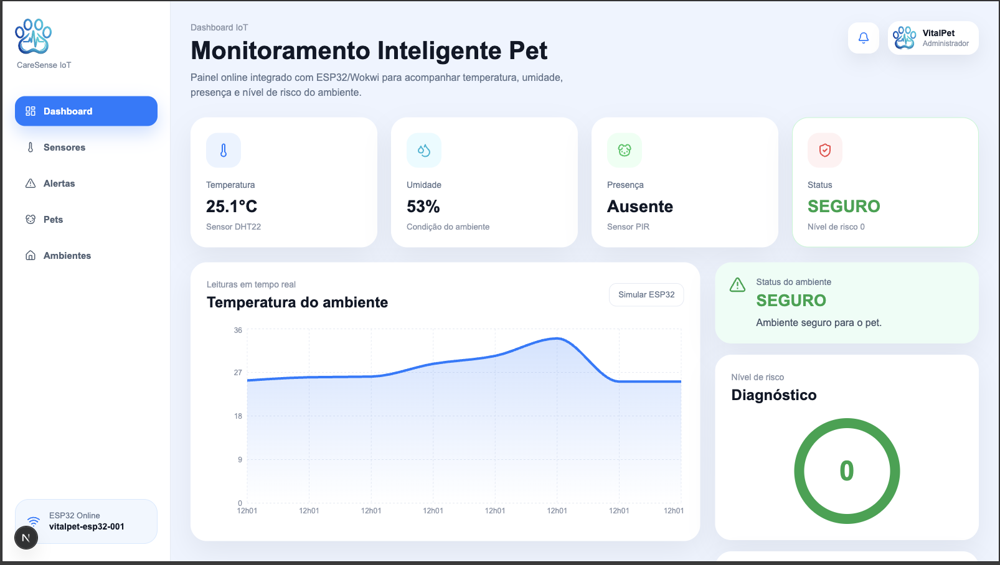
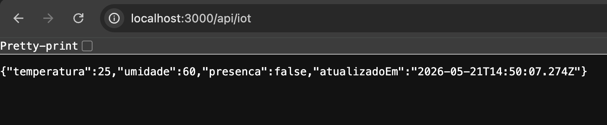
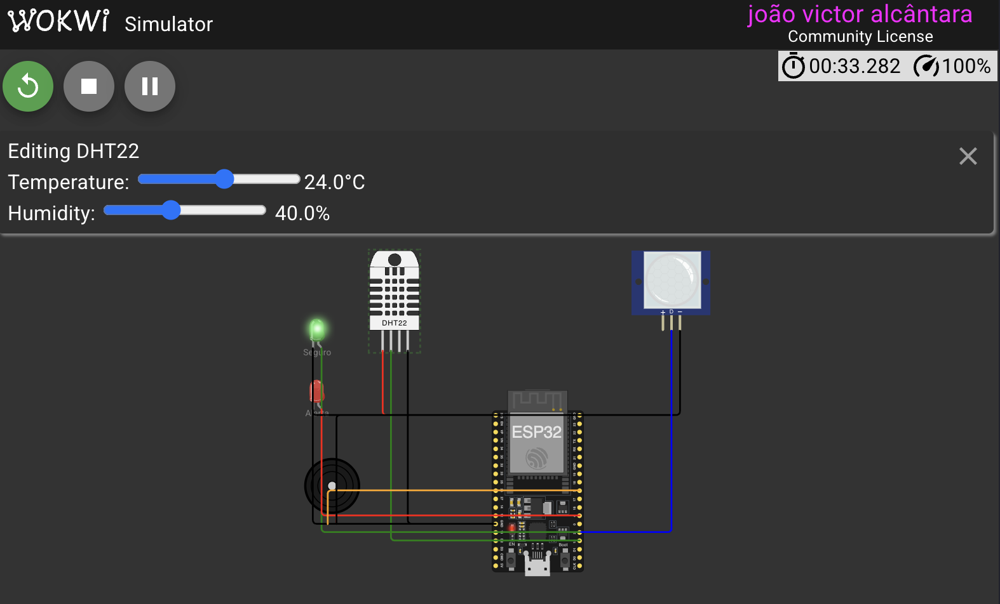
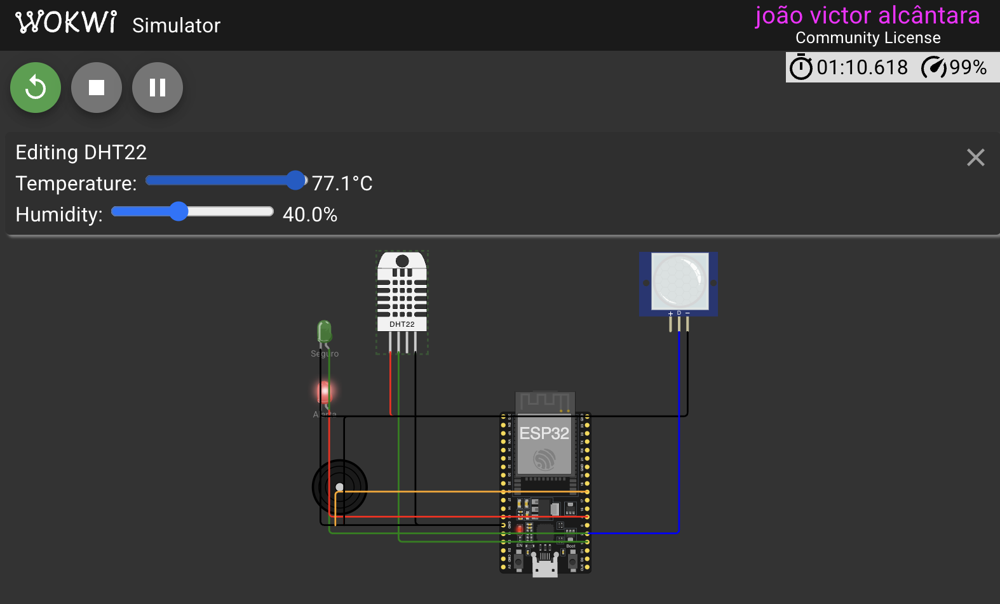

# 🐾 VitalPet CareSense IoT

## 👨‍💻 Integrantes

- João Victor Alcântara — RM562707
- Phillipo Barbosa — RM565399
- Vitor Madrigrano — RM564191
- Eduardo Martins — RM562259

---

# 📌 Descrição do Projeto

O VitalPet CareSense IoT é uma solução inteligente para monitoramento de ambientes destinados a pets, utilizando sensores IoT integrados a um dashboard web em tempo real.

O sistema tem como objetivo identificar situações de risco envolvendo:

- Temperatura elevada
- Umidade inadequada
- Presença do animal em ambientes críticos

Quando o ambiente apresenta risco para o pet, o sistema alerta o usuário através do dashboard.

---

# 🚨 Problema

Animais domésticos podem sofrer riscos graves quando permanecem em ambientes fechados com temperatura elevada, baixa circulação de ar ou condições inadequadas de umidade.

Muitos tutores não conseguem monitorar essas informações em tempo real, principalmente quando estão fora de casa.

---

# ✅ Solução Proposta

Desenvolvemos uma solução IoT utilizando ESP32 + sensores DHT22 e PIR, integrados a um dashboard inteligente.

O sistema:

- monitora temperatura
- monitora umidade
- detecta presença do pet
- classifica o nível de risco do ambiente
- exibe informações em tempo real no painel web

---

# 🛠️ Tecnologias Utilizadas

## Front-end / Dashboard

- Next.js
- TypeScript
- Recharts
- Lucide React
- CSS

---

## IoT

- ESP32
- Sensor DHT22
- Sensor PIR
- Wokwi Simulator

---

## Comunicação

- HTTP
- API REST

---

# 🌡️ Sensores Utilizados

## DHT22

Responsável por monitorar:

- temperatura
- umidade

---

## PIR

Responsável por detectar:

- presença do pet no ambiente

---

# 📊 Funcionalidades

- Dashboard em tempo real
- Simulação de dados IoT
- Integração com API
- Monitoramento de temperatura
- Monitoramento de umidade
- Detecção de presença
- Nível de risco automático
- Histórico gráfico de temperatura
- Comunicação simulada ESP32 → Dashboard

---

# 🔌 Integração IoT

O sistema possui uma rota API:

```bash
/api/iot
```

Ela recebe dados simulando o envio realizado pelo ESP32/Wokwi.

---

## Exemplo de envio

```json
{
  "temperatura": 32,
  "umidade": 40,
  "presenca": true
}
```

O dashboard consome essas informações automaticamente e atualiza os componentes em tempo real.

---

# ▶️ Como Rodar o Projeto

## 1. Clonar o repositório

```bash
git clone https://github.com/alc-joao/VitalPet-CareSense-Dashboard
```

---

## 2. Entrar na pasta do projeto

```bash
cd VitalPet-CareSense-Dashboard
```

---

## 3. Instalar dependências

```bash
npm install
```

---

## 4. Rodar o projeto

```bash
npm run dev
```

---

## 5. Abrir no navegador

```bash
http://localhost:3000
```

---

# 🧪 Como Testar a API IoT

## GET

Abra no navegador:

```bash
http://localhost:3000/api/iot
```

---

## POST

Execute no terminal:

```bash
curl -X POST http://localhost:3000/api/iot \
-H "Content-Type: application/json" \
-d '{"temperatura":32,"umidade":40,"presenca":true}'
```

---

# 📈 Resultado Parcial

O sistema já consegue:

✅ Simular sensores IoT  
✅ Atualizar dashboard em tempo real  
✅ Exibir nível de risco do ambiente  
✅ Integrar API REST com interface web  
✅ Demonstrar fluxo ESP32/Wokwi → Dashboard  

---

# 🧠 Estrutura do Sistema

```txt
ESP32/Wokwi
      ↓
API REST (/api/iot)
      ↓
Dashboard VitalPet
      ↓
Monitoramento em tempo real
```

---

# 📷 Evidências

## Dashboard



---

## API IoT



---

## Wokwi




---

# 🔗 Repositórios

## Dashboard Web

Deploy online:

https://vital-pet-care-sense-dashboard.vercel.app/

GitHub:

https://github.com/alc-joao/VitalPet-CareSense-Dashboard

---

## Protótipo IoT / Wokwi

https://github.com/alc-joao/VitalPet-CareSense-IoT

# 🎥 Vídeo Pitch

Link do vídeo no YouTube não listado:

```txt
https://www.youtube.com/watch?v=V01GOaKJrWY
```

---

# 📦 Entrega Final

A entrega contém:

- Código-fonte
- Dashboard web
- Protótipo IoT
- README
- Evidências
- Vídeo pitch
- Links GitHub
- Integração simulada ESP32/Wokwi

---

# 🐾 VitalPet CareSense IoT

Projeto acadêmico desenvolvido para o Challenge Clyvo — FIAP.