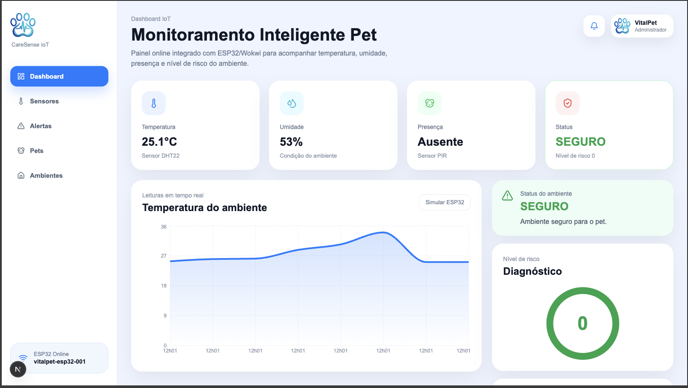
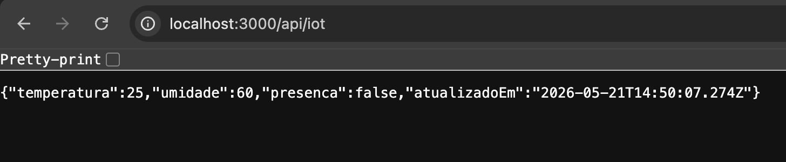
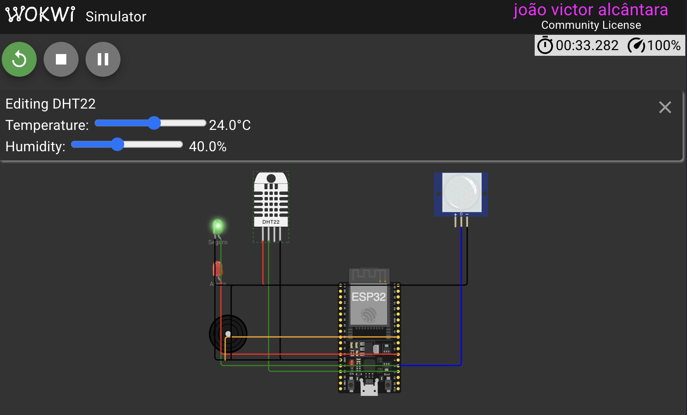
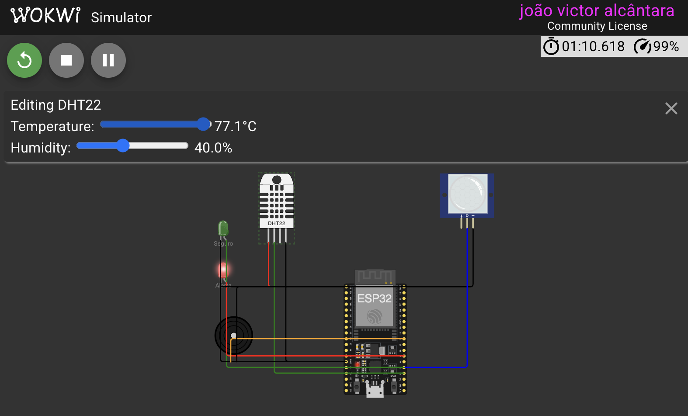

# 🐾 VitalPet CareSense — Dashboard Inteligente

## 👨‍💻 Integrantes

* João Victor Alcântara — RM562707
* Phillipo Barbosa — RM565399
* Leonardo Aragaki — RM562944
* Eduardo Martins — RM562259

---

# 📌 Descrição do Projeto

O **VitalPet CareSense** é uma solução inteligente para monitoramento de ambientes destinados a pets, integrando **Internet das Coisas (IoT), Dashboard Web e Inteligência Artificial**.

A solução utiliza um protótipo IoT baseado em **ESP32**, sensor **DHT22** e sensor **PIR** para coletar informações ambientais e enviá-las para uma API integrada ao dashboard.

O sistema monitora:

* Temperatura do ambiente
* Umidade
* Presença do pet
* Nível de risco ambiental

Além do monitoramento em tempo real, o projeto conta com o **CareSense AI**, responsável por analisar os dados coletados considerando também informações do animal monitorado e gerar uma avaliação contextualizada da situação.

---

# 🚨 Problema

Pets podem permanecer em ambientes inadequados sem que seus tutores percebam imediatamente.

Temperaturas elevadas, níveis inadequados de umidade e a permanência do animal no ambiente podem representar riscos, principalmente quando o tutor está fora de casa e não consegue acompanhar essas condições.

Somente visualizar dados brutos dos sensores também pode não ser suficiente para que o tutor compreenda rapidamente a gravidade da situação.

---

# ✅ Solução Proposta

O **VitalPet CareSense** combina IoT, desenvolvimento web e Inteligência Artificial para transformar dados ambientais em informações úteis para o tutor.

A solução:

* Monitora temperatura
* Monitora umidade
* Detecta presença do pet
* Recebe dados enviados pelo ESP32
* Classifica automaticamente o nível de risco
* Exibe informações em um dashboard web
* Mantém histórico das leituras
* Permite cadastrar informações do pet
* Utiliza IA para analisar o contexto ambiental
* Gera orientações contextualizadas por meio do CareSense AI

---

# 🧠 CareSense AI

O **CareSense AI** é a camada de Inteligência Artificial integrada ao dashboard do VitalPet.

Enquanto os sensores fornecem informações objetivas sobre o ambiente, a IA utiliza esses dados juntamente com informações cadastradas sobre o animal para produzir uma análise mais contextualizada.

A análise pode considerar informações como:

* Temperatura atual
* Umidade atual
* Presença detectada
* Nível de risco identificado
* Espécie do animal
* Raça
* Idade
* Peso
* Informações adicionais cadastradas no perfil do pet

A partir desse contexto, o CareSense AI gera uma avaliação textual para auxiliar o tutor na interpretação da situação.

> O CareSense AI possui finalidade informativa e preventiva e não substitui avaliação ou orientação de um médico-veterinário.

---

# 🏗️ Arquitetura da Solução

```txt
┌──────────────────────────────┐
│        ESP32 / Wokwi         │
│                              │
│   DHT22          PIR         │
│ Temperatura     Presença     │
│ Umidade                      │
└──────────────┬───────────────┘
               │
               │ HTTP / JSON
               ▼
┌──────────────────────────────┐
│          API REST            │
│          /api/iot            │
└──────────────┬───────────────┘
               │
               ▼
┌──────────────────────────────┐
│   VitalPet CareSense         │
│        Dashboard             │
│                              │
│ • Dados ambientais           │
│ • Nível de risco             │
│ • Histórico                  │
│ • Informações do pet         │
└──────────────┬───────────────┘
               │
               ▼
┌──────────────────────────────┐
│        CareSense AI          │
│                              │
│ Análise contextualizada dos  │
│ dados ambientais e do pet    │
└──────────────────────────────┘
```

---

# 🛠️ Tecnologias Utilizadas

## Dashboard Web

* Next.js
* TypeScript
* React
* Recharts
* Lucide React
* CSS

## IoT

* ESP32
* Sensor DHT22
* Sensor PIR
* PlatformIO
* Arduino Framework
* Wokwi Simulator

## Inteligência Artificial

* CareSense AI
* Integração de IA via API
* Engenharia de prompt com contexto ambiental e informações do pet

## Comunicação

* HTTP
* API REST
* JSON

## Deploy

* Vercel

---

# 🌡️ Sensores Utilizados

## DHT22

Responsável pela coleta de:

* Temperatura
* Umidade

Essas informações são utilizadas pelo sistema para avaliar as condições ambientais onde o pet se encontra.

## PIR

Responsável pela detecção de presença no ambiente.

A presença permite que o sistema considere se o animal está potencialmente exposto às condições ambientais identificadas pelos sensores.

---

# 📊 Funcionalidades

O VitalPet CareSense possui:

* Dashboard de monitoramento
* Recebimento de dados do ESP32
* Monitoramento de temperatura
* Monitoramento de umidade
* Detecção de presença
* Classificação automática do nível de risco
* Histórico gráfico das leituras
* API REST para comunicação IoT
* Cadastro de informações do pet
* Integração com Inteligência Artificial
* Análise contextualizada através do CareSense AI
* Interface responsiva
* Deploy web

---

# 🔌 Integração IoT

O Dashboard disponibiliza a rota:

```txt
/api/iot
```

Essa rota é responsável pelo recebimento dos dados enviados pelo dispositivo IoT.

O ESP32 realiza requisições HTTP enviando os valores coletados pelos sensores.

## Exemplo de dados

```json
{
  "temperatura": 32,
  "umidade": 40,
  "presenca": true
}
```

O Dashboard utiliza essas informações para atualizar o monitoramento e determinar o estado atual do ambiente.

---

# 🚦 Classificação de Risco

Com base nos dados recebidos pelos sensores, o sistema determina o nível de risco ambiental.

A classificação permite que o tutor identifique rapidamente se as condições atuais exigem atenção.

Os dados de risco também são utilizados como parte do contexto enviado ao **CareSense AI**, permitindo uma interpretação mais completa da situação.

---

# 🔄 Fluxo de Funcionamento

```txt
1. Sensores realizam as leituras
              ↓
2. ESP32 processa os dados
              ↓
3. ESP32 envia JSON via HTTP
              ↓
4. API /api/iot recebe os dados
              ↓
5. Dashboard atualiza o monitoramento
              ↓
6. Sistema determina o nível de risco
              ↓
7. Dados ambientais + perfil do pet
   são utilizados pelo CareSense AI
              ↓
8. IA gera análise contextualizada
              ↓
9. Tutor visualiza informações e
   orientações no Dashboard
```

---

# ▶️ Como Rodar o Projeto

## 1. Clonar o repositório

```bash
git clone https://github.com/alc-joao/VitalPet-CareSense-Dashboard.git
```

## 2. Entrar na pasta

```bash
cd VitalPet-CareSense-Dashboard
```

## 3. Instalar as dependências

```bash
npm install
```

## 4. Configurar variáveis de ambiente

Caso a integração com Inteligência Artificial utilize uma chave de API, configure o arquivo de variáveis de ambiente conforme a implementação do projeto.

Nunca publique chaves privadas ou tokens diretamente no GitHub.

## 5. Executar em desenvolvimento

```bash
npm run dev
```

## 6. Abrir no navegador

```txt
http://localhost:3000
```

---

# 🧪 Como Testar a API IoT

## GET

Com o projeto em execução, acesse:

```txt
http://localhost:3000/api/iot
```

## POST

Também é possível simular manualmente uma leitura utilizando:

```bash
curl -X POST http://localhost:3000/api/iot \
-H "Content-Type: application/json" \
-d '{"temperatura":32,"umidade":40,"presenca":true}'
```

Após o envio, os novos dados podem ser visualizados no Dashboard.

---

# 🤖 Fluxo do CareSense AI

O fluxo da análise inteligente pode ser representado da seguinte maneira:

```txt
Dados IoT
   +
Perfil do Pet
   +
Nível de Risco
      ↓
Construção do contexto
      ↓
CareSense AI
      ↓
Análise contextualizada
      ↓
Orientação exibida ao tutor
```

Essa abordagem permite que a aplicação vá além da simples apresentação de números coletados pelos sensores.

---

# 📈 Resultado da Sprint

Nesta etapa, o projeto consegue:

✅ Coletar dados através do protótipo IoT

✅ Monitorar temperatura e umidade

✅ Detectar presença

✅ Enviar dados do ESP32 para a API

✅ Receber informações através da API REST

✅ Atualizar o Dashboard

✅ Classificar o nível de risco ambiental

✅ Exibir histórico das leituras

✅ Trabalhar com informações do pet

✅ Integrar Inteligência Artificial ao Dashboard

✅ Gerar análises através do CareSense AI

✅ Demonstrar o fluxo completo IoT → API → Dashboard → IA

---

# 📷 Evidências

## Dashboard



---

## API IoT



---

## Protótipo IoT / Wokwi





---

# 🔗 Projeto

## Dashboard Web

### Deploy

https://vital-pet-care-sense-dashboard.vercel.app/

### Repositório

https://github.com/alc-joao/VitalPet-CareSense-Dashboard

---

## IoT / ESP32 / Wokwi

### Repositório

https://github.com/alc-joao/VitalPet-CareSense-IoT

---

# 🎥 Vídeo Pitch

Vídeo demonstrativo do projeto:

**Link:** será adicionado antes da entrega final.

---

# 📦 Entrega

A solução é composta por:

* Código-fonte do Dashboard
* Código-fonte do ESP32
* Protótipo IoT
* Sensores DHT22 e PIR
* API REST
* Dashboard web
* Integração com CareSense AI
* Histórico de monitoramento
* Classificação de risco
* Evidências do funcionamento
* Documentação
* Deploy online
* Vídeo demonstrativo
* Repositórios GitHub

---

# 🐾 VitalPet CareSense

Projeto acadêmico desenvolvido para o **Challenge Clyvo — FIAP**.

A proposta do VitalPet CareSense é demonstrar como **IoT, desenvolvimento web e Inteligência Artificial** podem trabalhar em conjunto para criar uma solução de monitoramento preventivo voltada ao bem-estar animal.
